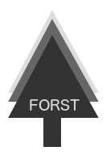

<div align="center">
    # 
</div>

> Radix Trie Hierarchical Configurations

[](https://travis-ci.org/web-mech/forst) [](https://github.com/conventional-changelog/standard-version) [](https://conventionalcommits.org)

## Setup

Add Forst as a dependency

    $ npm install --save forst

Create a folder in which your config tree(s) will live

#### Example

    $ mkdir conf

## Usage

Consider the following config tree directory

    /conf/
    ├── foo
    │   └── bar
    │       └── baz.json
    ├── test
    │   ├── bar.json
    │   └── foo.json -> { "enabled": false }
    └── test.json -> { "enabled": true, "name": "foo" }

#### Getting the base configuration:

    const forst = require('forst');

    forst('test', './conf').then(config => console.log(config));

    console.log(config); // { "enabled": true, "name": "foo" }

#### Getting the nested configuration:

    const forst = require('forst');

    forst(['test', 'test/foo'], './conf').then(config => console.log(config));

    console.log(config); // { "enabled": false,  "name": "foo" }

If the config file is not found it will return either the values of the parent configuration if found or an empty object if nothing is found.

### API

<!-- Generated by documentation.js. Update this documentation by updating the source code. -->

##### Table of Contents

-   [index](#index)
-   [map](#map)

#### index

forst

**Parameters**

-   `path` **([string](https://developer.mozilla.org/docs/Web/JavaScript/Reference/Global_Objects/String) \| [Array](https://developer.mozilla.org/docs/Web/JavaScript/Reference/Global_Objects/Array)&lt;[string](https://developer.mozilla.org/docs/Web/JavaScript/Reference/Global_Objects/String)>)** Config path
-   `basePath` **[string](https://developer.mozilla.org/docs/Web/JavaScript/Reference/Global_Objects/String)** Tree base path

#### map

forstMap

**Parameters**

-   `map` **[object](https://developer.mozilla.org/docs/Web/JavaScript/Reference/Global_Objects/Object)** Config path map
-   `basePath` **[string](https://developer.mozilla.org/docs/Web/JavaScript/Reference/Global_Objects/String)** Tree base path

#### Diagram

```mermaid
flowchart TD
subgraph Filesystem as Radix Trie
A[conf/] --> B[test.json {enabled:true, name:"foo"}]
A --> C[test/]
C --> D[test/foo.json {enabled:false}]
C --> E[test/bar.json {foo:"baz"}]
A --> F[foo/]
F --> G[foo/bar/baz.json {hello:"world"}]
end

subgraph Recursive Fallback
    D -.->|fallback to| B
    E -.->|fallback to| B
    G -.->|fallback to| F
end

subgraph Merge Resolution
    H[lookupReduce()] --> I[forst('test') => {enabled:true, name:"foo"}]
    I --> J[forst('test/foo') => {enabled:false}]
    J --> K[n-deep-merge => {enabled:false, name:"foo"}]
end

subgraph Map Expansion
    L[forstMap()] --> M[foo -> forst('test')]
    L --> N[superFoo -> forst(['test','test/bar'])]
    L --> O[amazingFoo -> forst(['test','test/bar','foo/bar/baz'])]
end

classDef fallback fill:#ffe3b3,stroke:#ffad33,stroke-width:2px;
classDef merge fill:#d2f8d2,stroke:#6c6,stroke-width:2px;
classDef trie fill:#d0e6ff,stroke:#4a90e2,stroke-width:2px;

class B,C,D,E,F,G trie;
class D,E,G fallback;
class H,I,J,K merge;
```


<div align="center">
  <h2>Sponsors</h2>
  <p>
    The ideas and initial development of this project (formerly known as mwconf) has been sponsored by Mindfulware, a Software Development Company.
  </p>
  <a href="https://mindfulware.com" target="_blank">
    
  </a>
  <p>
    Mindfulware: Integrity, Performance, Design
  </p>
</div>
